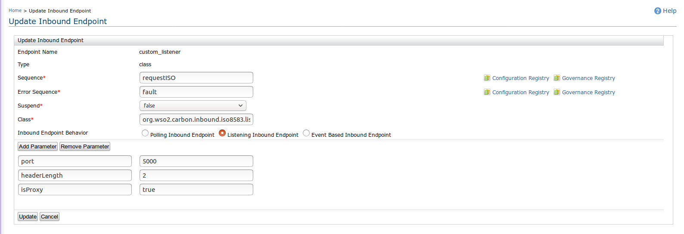

# Configuring ISO8583 Inbound Endpoint Operations

The ISO8583 inbound endpoint listens on port 5000 and acts as a ISO8583 standard message consumer. When a sample java client connects on port 5000, the ISO8583 inbound endpoint consumes ISO8583 standard messages, converts the messages to XML format, and then injects messages to a sequence in the ESB Profile of WSO2 Enterprise Integrator (WSO2 EI).

Follow the steps below to configure the ISO8583 inbound endpoint to work with the ESB Profile of WSO2 EI:

1. Go to [https://store.wso2.com/store/assets/esbconnector/details/iso8583](https://store.wso2.com/store/assets/esbconnector/details/e4cf3fd5-445f-4317-beb6-09998906fb0d), and click **Download Streaming Connector** to download the org.wso2.carbon.inbound.iso8583-1.0.1.jar file. Then add the downloaded .jar file to the <EI_HOME>/lib directory.
2. Download the following .jar files from the given locations and copy the files to the <EI_HOME>/lib directory:
   * Download jpos-1.9.4.jar from [http://mvnrepository.com/artifact/org.jpos/jpos/1.9.4](http://mvnrepository.com/artifact/org.jpos/jpos/1.9.4). 
   * Download jdom-1.1.3.jar from [http://mvnrepository.com/artifact/org.jdom/jdom/1.1.3](http://mvnrepository.com/artifact/org.jdom/jdom/1.1.3).
   * Download commons-cli-1.3.1.jar from [http://mvnrepository.com/artifact/commons-cli/commons-cli/1.3.1](http://mvnrepository.com/artifact/commons-cli/commons-cli/1.3.1).
3. Restart the ESB Profile of WSO2 EI.

>> NOTE: The ISO8583 inbound endpoint uses the jpos library, which is a third party library that provides a high-performance bridge between card messages generated at point of sale terminals, ATMs, and internal systems across the entire financial messaging network. The jposdef.xml file has the field definitions of standard ISO8583 messages. According to the field definitions, each ISO8583 message that comes from a client is unpacked to identify the fields of the ISO8583 standard message.

**Sample Configuration**

Following is a sample ISO8583 inbound endpoint configuration:

```xml
<inboundEndpoint
        class="org.wso2.carbon.inbound.iso8583.listening.ISO8583MessageConsumer"
        name="custom_listener" onError="fault" sequence="requestISO" suspend="false">
        <parameters>
            <parameter name="inbound.behavior">listening</parameter>
            <parameter name="port">5000</parameter>
            <parameter name="headerLength">2</parameter>
            <parameter name="isProxy">true</parameter>
        </parameters>
</inboundEndpoint>
```
In the sample configuration, the port is the most important parameter because this is the port via which the client connects to the ISO8583 inbound endpoint.

>> NOTE : For testing purposes, you need to have a java client application that can produce ISO8583 standard messages. The client application should also be able to get acknowledgement from the inbound endpoint. For this, you can use the sample Java client program that is provided in the following git location: https://github.com/wso2-docs/CONNECTORS/tree/master/ISO8583/ISO8583TestServer.

If you want to add the above configure via the ESB Profile Management Console, follow the steps below:
1. On the **Main** tab, click **Inbound Endpoints** > Add Inbound Endpoint. This displays the New Inbound Endpoint screen.
2. Specify an appropriate **Endpoint Name** and select Custom as the **Type**.
3. Click **Next**. You will see the following screen:
   
4. Enter appropriate values for all required fields and click **Save**.

Following are descriptions of the parameters that you can specify in a sample ISO8583 inbound endpoint configuration.
         
| Parameter| Description | Required | Possible Values | Default Value |
| ------------- |-------------| ---------------| ------------- |-------------|
| port    | Hosts have ports, socket connection will create according to that port and server started to listening to that port , once the socket connection is established. | Yes | 0-65535 | 5000 |
| headerLength    | The length of the header of the ISO message | No | 0, 2 or 4 | 0 |
| coreThreads | The number of threads to maintain in the pool. | No |- |- |
| maxThreads | The maximum number of  threads to allow in the pool at any given time. | No |- |- |
| keepAlive | The maximum time after which idle corePoolSize threads should be terminated, in case the pool currently has more than the expected number of corePoolSize threads. | No |- |- |
| isProxy | Whether the inbound endpoint is acting as a proxy for another backend service or whether it is processing the message itself. | No | true/false| false |

>>NOTE: To handle concurrent messages in an ISO8583 inbound endpoint, you need to create a thread pool that contains a varying amount of threads. The number of threads in the pool should be determined by the following variables:  
>>* **corePoolSize**: The number of allocated threads to keep in the pool, even if they are idle.
>>* **maximumPoolSize**: The maximum number of threads to allow in the pool at any given time.
         
>>TIP: Another parameter that you in specify in the threadPool configuration is keepAliveTime. It is the maximum time that excess idle threads can be alive, before a task terminates. 
